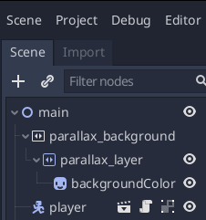

Platform Game
============================

`Videos to accompany this tutorial <https://tinyurl.com/yxcc3afp>`_

This is a simple platformer that uses Godot's physics engine to produce a fun game with very little code.
It's a good introduction to using tilemaps and scrolling cameras and can be the basis for a fully featured
game.  We won't be going into as much depth about how everything works in this tutorial, in order to get
something working as quickly as possible.

Install Godot
-------------

.. raw:: html

   <iframe width="560" height="315" src="https://www.youtube.com/embed/Wend9ao8uy8" frameborder="0" allow="accelerometer; autoplay; encrypted-media; gyroscope; picture-in-picture" allowfullscreen>

   </iframe>

`Download Godot from the website <https://godotengine.org/download>`_

Or install it from the software centre on Linux.

Import starter project
----------------------

.. raw:: html

   <iframe width="560" height="315" src="https://www.youtube.com/embed/ovt4hS9iLYY" frameborder="0" allow="accelerometer; autoplay; encrypted-media; gyroscope; picture-in-picture" allowfullscreen>

   </iframe>

1. Download `godot_platformer1.zip <https://electronstudio.github.io/godot_platformer/godot_platformer1.zip>`_ and unzip
   it somewhere you can find it, e.g. your documents folder.

2. Run Godot.  The project manager opens. Select **import**.

3. Double click the **project.godot** file in
   **godot_platformer1** folder.

   .. image:: import.png
      :width: 80%

4. Project may take a while to import. When it has finished, click the
   run button to test it and play the game.

5. If you're using Git, create a repo now.

The player
---------------

The player is a **KinematicBody** node.

Run the game.  You will find the player can move, but not much else.

Open the file **player.gd** and look at the code.  The **_physics_process()** function is called
by Godot automatically, approximately once per frame.  (If we weren't using the physics engine
we could use **_update()** instead, which is always called every frame.)

The physics engine is able to tell us whether the player **is_on_floor()** or else is in the air.  We set different
velocity and animations appropriately.  The player is a **KinematicBody** and so we need to call **mode_and_slide()** in
order for the physics to actually do anything.

Note the use of **lerp()** to slow the player down in a smooth way.  This uses `linear interpolation <https://en.wikipedia.org/wiki/Linear_interpolation>`_.

Player code
-----------

Add this code to the *end* of the **player.gd** file.  Note the first line is indented.

.. code-block:: gdscript

       if jump_timer > 0:
           jump_timer -= delta
           if Input.is_action_pressed('jump'):
               velocity.y = -400
               if not $phaseJump1.playing: $phaseJump1.play()

       $alien_pink.flip_h = velocity.x < 0
       
       if position.y>700:
           kill()

       for i in get_slide_count():
           var collider = get_slide_collision(i).collider
           if collider.has_method("kill"):
               if position.y < collider.position.y - 10:
                   velocity.y = -400
                   collider.kill()

   func kill():
       get_tree().reload_current_scene()

Test the game again.  You should find you can now:

* Jump.

* Fall off the bottom of the screen.

* Face the opposite direction.

* Make noise.

* (Soon: Kill things you jump on)

.. note::

   Try to work out what each line does and which lines are responsible for which features.  If you don't understand any lines, ask your teacher.

.. topic:: Challenges

   -  Make the player jump higher.

   -  Make the player run faster.

   -  Make the player fall slower.

The bee
-------

The bee is different from the player.  It's a **RigidBody** node.  Currently it is quite harmless.  Take a look at its nodes.

.. topic:: Questions

   -  In the game, can you kick the bee where you want it to go?

   -  What makes the bee able to move at all when we have not written any code for it like we did the player?

Speed
-----

Try adding this line somewhere in the middle of the **player.gd** file:

::

   velocity.x = clamp(velocity.x, -300, 300)

.. topic:: Question

   What does it do?

Scrolling
---------

1. Right-click on the **player** node and select **Add Child Node**.  Choose **Camera2d** node.

2. In the inspector, click **Current** **On** to enable the camera.

3. Test the game again.

Map
---

1. Click the **tilemap2** node.

2. Click left mouse to place a tile and right mouse to delete a tile
   (you can delete my tiles if you like).

3. Create your own level.

Parallax Scrolling Background
-----------------------------

1. Add a **ParallaxBackground** node to main scene. Drag it so that it is
   the *first child node* in the scene.

2. Add a **ParallaxLayer** as child node of this.

3. In the Inspector, set **Motion->Scale->x** to **0.5**.

4. Set **Motion->Mirroring-X** to **1024**.

5. Look at the images in the **backgrounds** folder. Drag in an image, eg.
   **backgroundColorForest.png** to the scene and drag it to become
   child of **ParallaxLayer**.

   Your node tree should look like this.

.. topic:: Question

   What is Parallax?

Coins
----------------------

There is one coin node, an **Area2d**, already added for you. It has a
sound, image and collision shape but it doesn't have a script.

Right click it, select **attach script**, press **Create**. Delete all the
code that is there and enter the new code:

.. code-block:: gdscript

   extends Area2D

   var collected = false

   func _on_coin_body_entered(body):
       if not collected:
           hide()
           $powerUp5.play()
           get_tree().get_current_scene().get_node("HUD").inc_score()
           collected = true

.. note:: Later, once you know about global variables, it would probably be better to use a global variable for the score
   rather that putting it in the HUD node as I have done.

Instancing
----------

Since we will have a lot of coins it makes sense to make the coin a
separate scene and then instance this scene every time we want to make a
coin. Right click the **coin** node, select **save branch as scene**, click
**save**.

Now right click on the **coins** node (parent of **coin**), select **instance child scene** and
select the **coin.tscn** scene you just created. Drag the coin to where you want it.  You could also use **Duplicate** to make more coins.

Enemies
-------

Unlike the coin, we will create our enemy scene from scratch.

1. Click **Scene** menu, then **New Scene** then click **2D Scene** as the
   root node.

2. Right click on the root **node_2d**. Click **Change type**. Find
   **KinematicBody2d** (you can type the name) and double click it.

3. Right click on the root **node_2d** and **rename** it to ``enemy``.

4. Press ctrl-S to save the scene. Name it ``enemy.tscn``.

Now we need to add several child notes to the root node.

1. In the filesystem, find **characters/enemies/ant.tscn**. (Or
   whatever character you want to use.)  Drag it on
   the (0,0) point in the scene. Right click on the node and
   rename it to ``sprite``.  Click on it and in the Inspector tick
   **playing** so we can see the animation.

2. Right-click the root node, **Add Child Node**, select
   **CollisionShape2d**. In the Inspector click on the **[empty]** shape and
   select **New Rectangleshape2d**.

   .. figure:: reddots.png
      :width: 40%

      Use the red drag spots to increase the
      size of the rectangle that has appeared on the sprite.

3. Add another child node to the root node. This time select
   **VisibilityEnabler2d**. In the inspector make sure ALL the boxes are
   ticked.

4. Right-click the root node, select **merge from scene**. Find
   **audio/digital_sfx.tscn** and double click it. Then select
   **pepSound3** from the node list. Press OK. Right click on the node
   and rename it to ``deathSound``.

.. figure:: enemynodes.png
   :width: 40%

   Your node tree should look like this.

Right-click the root note, select **attach script**. Change the
**Path** to ``res://enemy.gd``. Press **Create**. Erase the code
in the script and replace it with this:

.. code-block:: gdscript

   extends KinematicBody2D

   var direction = Vector2.LEFT
   var velocity = Vector2(-50, 0)

   func _ready():
       set_physics_process(false)

   func _physics_process(delta):
       velocity.y += 20
       velocity.x = direction.x * 50
       velocity = move_and_slide(velocity, Vector2.UP)
       
       if is_on_wall():
           direction = -direction
           
       for i in get_slide_count():
           var collider = get_slide_collision(i).collider
           if collider.has_method("kill"):
               collider.kill()

   func kill():
       $deathSound.play()
       direction = Vector2.ZERO
       $sprite.animation = 'dead'
       $collision_shape_2d.disabled = true
       get_node("/root/main/HUD").inc_score()

Now switch back to our **main.tscn** scene.  Click on the **enemies** node.   Add an enemy by dragging in **enemy.tscn**.

Test you can kill and be killed by the enemy.

Challenges
----------

Add more tiles, coins and enemies to create a challenging game.  Get your friends to play the game.

Change the player sprite to a different one.

Add a second player controlled by a second controller.

Add a timer.

Give the player limited lives, but add powerups for additional lives.

Give the player respawn points.

Create a title screen.

Create a gameover screen.

Add additional levels, and a level select screen.

